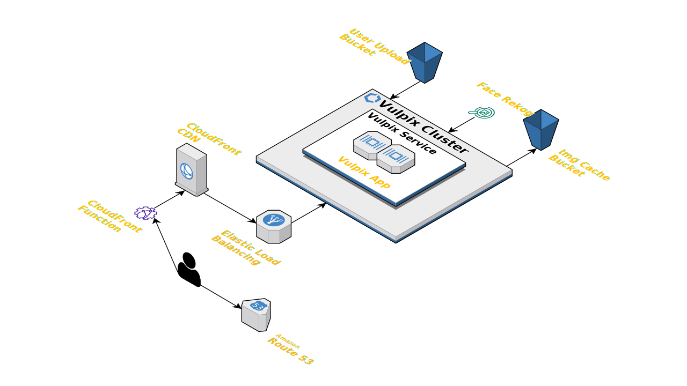

# Vulpix

An image processing web app built using [vulpix](https://crates.io/crates/vulpix).   
Used in production at [Apollo Agriculture](https://www.apolloagriculture.com) to process and serve images securely from aws.

The repo also acts as an example usage [vulpix](https://crates.io/crates/vulpix) library building an app using [axum](https://crates.io/crates/axum)

## setup

install from [rust](https://www.rust-lang.org/tools/install) 
or 

```bash
curl --proto '=https' --tlsv1.2 -sSf https://sh.rustup.rs | sh
```

install image magick

```bash
brew install imagemagick
```

aws env variables

```
AWS_ACCESS_KEY_ID=
AWS_SECRET_ACCESS_KEY=
AWS_REGION=
```

## dev 

```bash
cargo install cargo-watch
```

```bash
cargo watch -q -c -w ./lib -w ./server -w ./config -x run
```

or 

```bash
cargo dev
```

## build

```bash
cargo build --release
```

## configuration

configuration for running vulpix app lies in `config` folder. The default config is in `Default.toml` file.   
Local config can be overriden by adding to `Local.toml` file and similarly production config can be overriden by adding to `Production.toml`

## architecture

[](https://app.cloudcraft.co/view/d0e8a327-a494-4ab4-988d-7f06d477d232?key=6baefbf0-77f6-4261-99f8-c6f0353b841f&interactive=true&embed=true)
